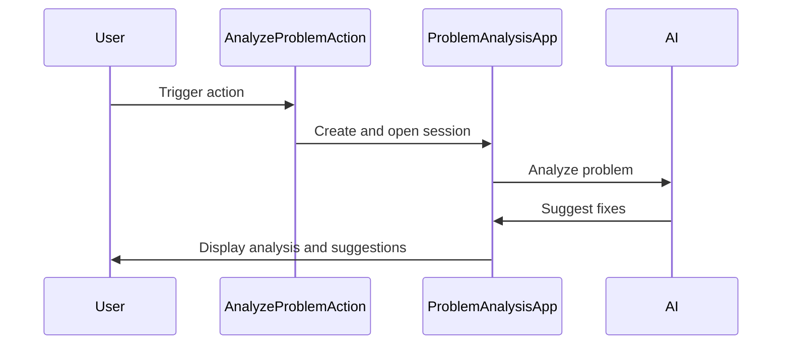

Here's a documentation overview for the provided code:

## Code Overview
- **Language & Frameworks:** Kotlin, IntelliJ IDEA Plugin Development
- **Primary Purpose:** Analyze and suggest fixes for coding problems in an IntelliJ IDEA environment
- **Brief Description:** This code defines an action (`AnalyzeProblemAction`) that analyzes coding problems in IntelliJ IDEA, opens a web-based interface for problem analysis, and suggests fixes using AI-powered code generation.

## Public Interface
- **Exported Functions/Classes:**
  - `AnalyzeProblemAction` class (extends `AnAction`)
  - `ProblemAnalysisApp` inner class (extends `ApplicationServer`)
- **Public Constants/Variables:** None
- **Types/Interfaces:** None explicitly defined

## Dependencies
- **External Libraries**
  - IntelliJ Platform SDK
  - OpenAI API (via `IdeaOpenAIClient`)
  - Various custom libraries (e.g., `com.simiacryptus.skyenet`, `com.simiacryptus.diff`)
- **Internal Code: Symbol References**
  - `AppServer`
  - `SessionProxyServer`
  - `TestResultAutofixAction`
  - `AppSettingsState`
  - `IdeaOpenAIClient`

## Architecture
- **Sequence Diagram:**

## Example Usage
The action is triggered within the IntelliJ IDEA environment, typically through a context menu or shortcut when a problem is selected in the Problems view.

## Code Analysis
- **Code Style Observations:**
  - Uses Kotlin idioms and language features
  - Extensive use of lambdas and functional programming concepts
  - Utilizes IntelliJ Platform APIs for integration
- **Code Review Feedback:**
  - Consider breaking down large methods (e.g., `analyzeProblem`) into smaller, more focused functions
  - Error handling could be improved with more specific exception types
- **Features:**
  - AI-powered problem analysis
  - Integration with IntelliJ IDEA's problem view
  - Web-based interface for displaying analysis results
  - Ability to apply suggested fixes directly to the code
- **Potential Improvements:**
  - Implement caching to improve performance for repeated analyses
  - Add user configuration options for AI model selection
  - Enhance error reporting and logging

## Tags
- **Keyword Tags:** IntelliJ, Plugin, AI, Code Analysis, Problem Solving
- **Key-Value Tags:**
  - Type: IntelliJ IDEA Plugin
  - Language: Kotlin
  - AI-Integration: OpenAI