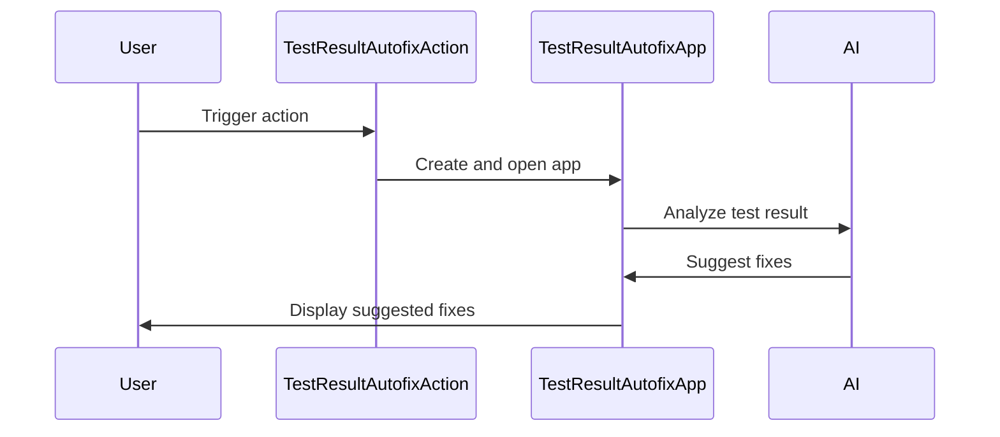

Here's a documentation overview for the provided code:

## Code Overview
- **Language & Frameworks:** Kotlin, IntelliJ Platform SDK
- **Primary Purpose:** Autofix action for test results in an IntelliJ IDEA plugin
- **Brief Description:** This code defines a TestResultAutofixAction that analyzes test failures and suggests fixes using AI-powered code generation.

## Public Interface
- **Exported Classes:**
  - TestResultAutofixAction
  - TestResultAutofixApp (inner class)
- **Public Constants/Variables:**
  - Companion object with utility functions

## Dependencies
- **External Libraries:**
  - IntelliJ Platform SDK
  - SkyeNet library
  - JOpenAI
- **Internal Code: Symbol References:**
  - BaseAction
  - CommandAutofixAction
  - AppSettingsState
  - IdeaOpenAIClient
  - AppServer

## Architecture
- **Sequence Diagram:**

## Example Usage
The action is triggered from the IntelliJ IDEA UI when a test fails. It opens a web interface where the user can view and apply suggested fixes.

## Code Analysis
- **Code Style Observations:** 
  - Follows Kotlin coding conventions
  - Uses functional programming concepts
  - Extensive use of IntelliJ Platform API
- **Code Review Feedback:**
  - Well-structured and modular
  - Good separation of concerns between action and application logic
- **Features:**
  - AI-powered test failure analysis
  - Automatic code fix suggestions
  - Integration with IntelliJ IDEA's test framework
- **Potential Improvements:**
  - Add more error handling and logging
  - Implement unit tests for the action and application logic

## Tags
- **Keyword Tags:** IntelliJ, Plugin, AI, TestAutofix, Kotlin
- **Key-Value Tags:**
  - Type: IntelliJ Plugin Action
  - AI-Powered: Yes
  - Test-Related: Yes