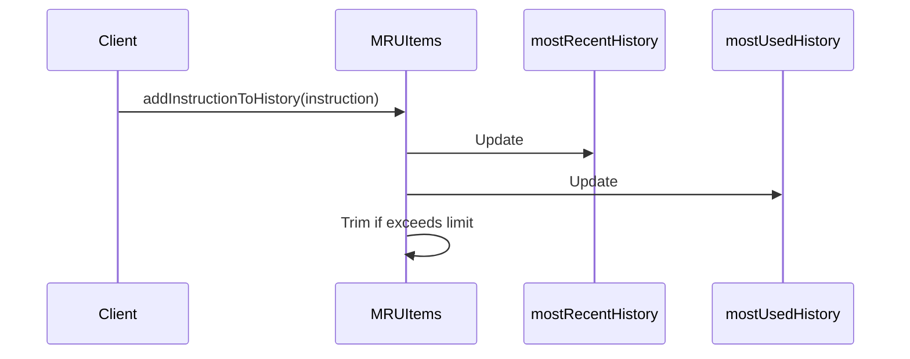

Here's the documentation for the provided code:

## Code Overview
- **Language & Frameworks:** Kotlin
- **Primary Purpose:** Manage a Most Recently Used (MRU) list of items
- **Brief Description:** This class implements a data structure to keep track of both most recently used and most frequently used items, with a limit on the number of items stored.

## Public Interface
- **Exported Functions/Classes:**
  - `MRUItems` class
  - `addInstructionToHistory(instruction: CharSequence)` function
- **Public Constants/Variables:**
  - `mostUsedHistory: MutableMap<String, Int>`
  - `mostRecentHistory: MutableList<String>`

## Dependencies
- **External Libraries**
  - Java standard library (java.util.Map, java.util.stream)
- **Internal Code: Symbol References**
  - None

## Architecture
- **Sequence or Flow Diagrams:** 


## Example Usage
```kotlin
val mruItems = MRUItems()
mruItems.addInstructionToHistory("Instruction 1")
mruItems.addInstructionToHistory("Instruction 2")
// Repeat for more instructions
```

## Code Analysis
- **Code Style Observations:**
  - Uses Kotlin's idiomatic syntax
  - Good use of synchronization for thread safety
- **Code Review Feedback:**
  - Consider making `historyLimit` configurable
  - Could benefit from more comments explaining the logic
- **Features:**
  - Maintains both most recently used and most frequently used items
  - Automatically trims the list when it exceeds the limit
- **Potential Improvements:**
  - Add method to retrieve the MRU or most frequently used items
  - Implement serialization for persistence

## Tags
- **Keyword Tags:** MRU, cache, history, frequency
- **Key-Value Tags:**
  - complexity: medium
  - thread-safe: yes
  - data-structure: map-and-list