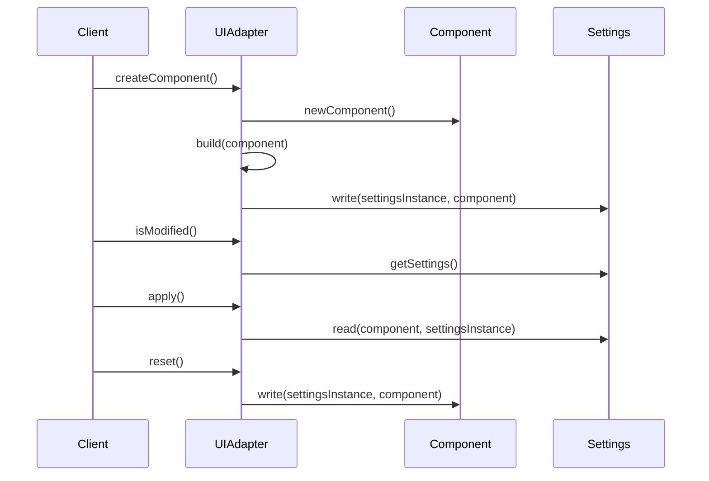

## Code Overview
- **Language & Frameworks:** Kotlin, IntelliJ Platform SDK
- **Primary Purpose:** Provide a base class for creating UI adapters for settings in IntelliJ IDEA plugins
- **Brief Description:** UIAdapter is an abstract class that implements the Configurable interface, providing a framework for creating and managing settings UIs in IntelliJ IDEA plugins.

## Public Interface
- **Exported Functions/Classes:**
  - UIAdapter (abstract class)
- **Public Constants/Variables:**
  - settingsInstance: S
  - component: C?
- **Types/Interfaces (if applicable):**
  - C: Any (generic type for component)
  - S: Any (generic type for settings)

## Dependencies
- **External Libraries**
  - com.intellij.openapi.Disposable
  - com.intellij.openapi.options.Configurable
  - org.slf4j.LoggerFactory
  - javax.swing.JComponent
- **Internal Code: Symbol References**
  - com.github.simiacryptus.aicoder.util.UITools

## Architecture
- **Sequence or Flow Diagrams:** 


## Example Usage
```kotlin
class MySettingsUIAdapter(settings: MySettings) : UIAdapter<MyComponent, MySettings>(settings) {
    override fun newComponent(): MyComponent = MyComponent()
    override fun newSettings(): MySettings = MySettings()
}
```

## Code Analysis
- **Code Style Observations:**
  - Uses Kotlin's nullable types and safe call operators
  - Implements thread-safe lazy initialization for mainPanel
  - Uses companion object for logger
- **Code Review Feedback:**
  - Good use of generics for flexibility
  - Proper error handling and logging
  - Well-structured with clear separation of concerns
- **Features:**
  - Lazy initialization of UI components
  - Thread-safe component creation
  - Automatic UI building using reflection
  - Support for custom component building
- **Potential Improvements:**
  - Consider using a more specific name than "C" and "S" for generic types
  - Add more documentation for abstract methods

## Tags
- **Keyword Tags:** IntelliJ, Plugin, Settings, UI, Adapter, Configurable
- **Key-Value Tags:**
  - Type: Abstract Class
  - Framework: IntelliJ Platform SDK
  - Language: Kotlin