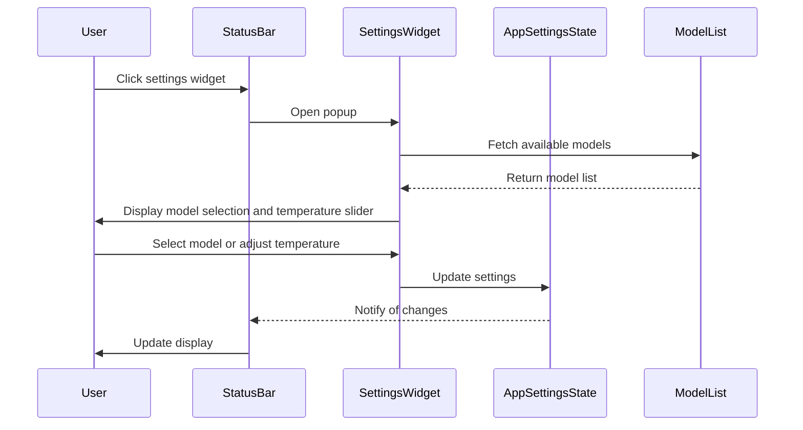

## Code Overview
- **Language & Frameworks:** Kotlin, IntelliJ Platform SDK
- **Primary Purpose:** To create a settings widget for the AI Coding Assistant plugin in IntelliJ-based IDEs
- **Brief Description:** This code defines a `SettingsWidgetFactory` and `SettingsWidget` for managing AI model settings in the IDE's status bar.

## Public Interface
- **Exported Functions/Classes:**
  - `SettingsWidgetFactory`: Implements `StatusBarWidgetFactory`
  - `SettingsWidget`: Implements `StatusBarWidget` and `StatusBarWidget.MultipleTextValuesPresentation`
- **Public Constants/Variables:** None explicitly defined
- **Types/Interfaces:** Implements `StatusBarWidgetFactory`, `StatusBarWidget`, `StatusBarWidget.MultipleTextValuesPresentation`

## Dependencies
- **External Libraries**
  - IntelliJ Platform SDK
  - AWS SDK (commented out)
  - kotlinx.coroutines
  - com.simiacryptus.jopenai
- **Internal Code: Symbol References**
  - `AppSettingsState`
  - `MyIcons`

## Architecture
- **Sequence or Flow Diagrams:** 

## Example Usage
This widget is automatically added to the IDE's status bar when the plugin is installed. Users can click on it to open a popup for selecting AI models and adjusting the temperature setting.

## Code Analysis
- **Code Style Observations:**
  - Kotlin idioms and best practices are generally followed
  - Use of lazy initialization for UI components
  - Extensive use of lambda expressions and functional programming concepts
- **Code Review Feedback:**
  - Consider breaking down the `SettingsWidget` class into smaller, more focused components
  - The AWS-related code is commented out but left in place, which might be confusing
- **Features:**
  - Model selection from a list of available AI models
  - Temperature adjustment via a slider
  - Integration with IntelliJ's status bar
  - Dynamic updating of settings and UI
- **Potential Improvements:**
  - Implement proper error handling for API calls and model loading
  - Consider moving the AWS-specific logic to a separate class or utility
  - Add more documentation, especially for complex logic or UI creation methods

## Tags
- **Keyword Tags:** IntelliJ, Plugin, AI, Settings, StatusBar, Widget
- **Key-Value Tags:**
  - Type: UI Component
  - Framework: IntelliJ Platform SDK
  - AI-Integration: OpenAI, AWS Bedrock (commented)