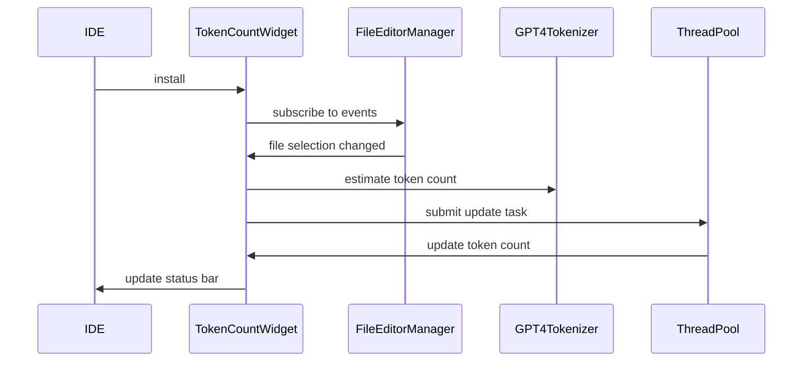

Here's a documentation overview for the provided Kotlin code:

## Code Overview
- **Language & Frameworks:** Kotlin, IntelliJ Platform SDK
- **Primary Purpose:** To create a status bar widget that displays token count for the current file or selection in an IntelliJ-based IDE.
- **Brief Description:** This code defines a `TokenCountWidgetFactory` that creates a status bar widget to show the token count of the current file or selected text using GPT-4 tokenization.

## Public Interface
- **Exported Functions/Classes:**
  - `TokenCountWidgetFactory` class
  - `TokenCountWidget` inner class
- **Public Constants/Variables:**
  - `workQueue`: LinkedBlockingDeque<Runnable>
  - `pool`: ThreadPoolExecutor

## Dependencies
- **External Libraries**
  - IntelliJ Platform SDK
  - GPT4Tokenizer (from com.simiacryptus.jopenai package)
- **Internal Code: Symbol References**
  - GPT4Tokenizer

## Architecture
- **Sequence Diagram:**

## Example Usage
This widget is automatically installed in the IDE's status bar when the plugin is loaded. It will display the token count for the current file or selection.

## Code Analysis
- **Code Style Observations:**
  - Follows Kotlin coding conventions
  - Uses coroutines and thread pool for asynchronous operations
- **Code Review Feedback:**
  - Good separation of concerns between widget factory and widget implementation
  - Efficient use of thread pool to prevent UI blocking
- **Features:**
  - Real-time token count updates for file content and selections
  - Uses GPT-4 tokenization for accurate counts
- **Potential Improvements:**
  - Consider adding configuration options for tokenization method
  - Implement caching to reduce unnecessary tokenization operations

## Tags
- **Keyword Tags:** IntelliJ, Plugin, StatusBar, Widget, TokenCount, GPT4, Tokenizer
- **Key-Value Tags:**
  - Type: UI Component
  - Framework: IntelliJ Platform SDK
  - Functionality: Token Counting