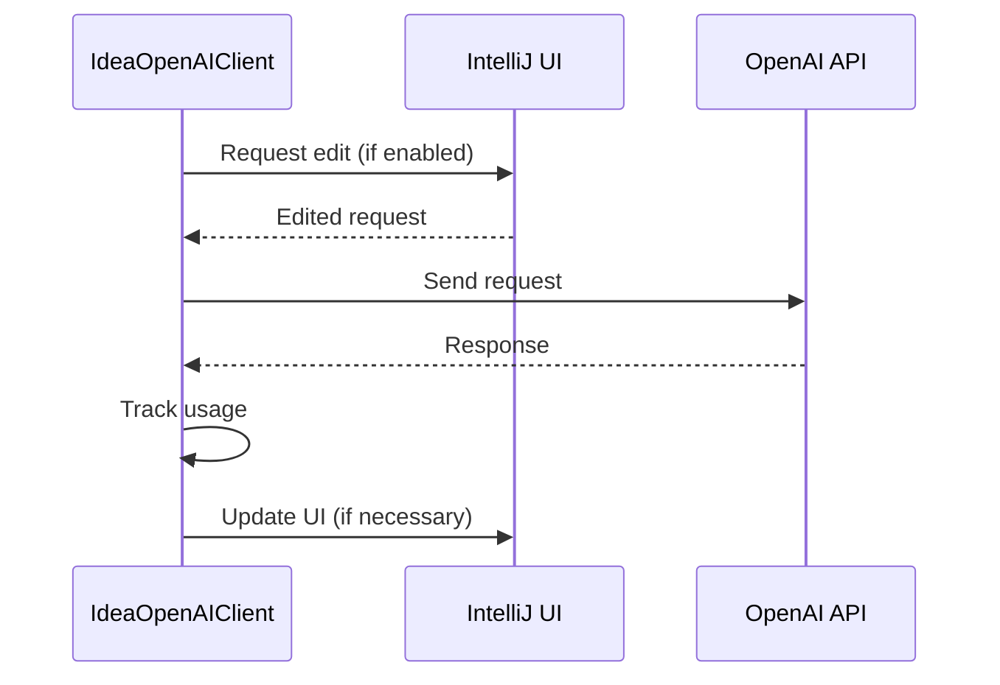

Here's a documentation overview for the provided Kotlin code:

## Code Overview
- **Language & Frameworks:** Kotlin, IntelliJ IDEA Plugin Development
- **Primary Purpose:** Custom OpenAI client implementation for an IntelliJ IDEA plugin
- **Brief Description:** This class, `IdeaOpenAIClient`, extends the `OpenAIClient` to provide custom functionality for an IntelliJ IDEA plugin, including request editing, usage tracking, and integration with the IDE's UI.

## Public Interface
- **Exported Classes:** `IdeaOpenAIClient`
- **Public Constants/Variables:**
  - `instance`: Lazy-initialized singleton instance of `IdeaOpenAIClient`
  - `lastEvent`: Stores the last `AnActionEvent`
  - `currentSession`: Unique identifier for the current session
  - `localUser`: Represents the local user

## Dependencies
- **External Libraries:**
  - IntelliJ Platform SDK
  - Apache HttpComponents
  - SLF4J
  - Custom OpenAI client library (com.simiacryptus.jopenai)
- **Internal Code: Symbol References:**
  - `AppSettingsState`
  - `UITools`
  - `ApplicationServices`

## Architecture
- **Sequence Diagram:**


## Example Usage
```kotlin
val client = IdeaOpenAIClient.instance
val response = client.chat(chatRequest, model)
```

## Code Analysis
- **Code Style Observations:**
  - Extensive use of Kotlin features (lazy initialization, companion objects)
  - Heavy use of IntelliJ Platform API for UI integration
- **Code Review Feedback:**
  - Consider breaking down large methods (e.g., `chat`, `complete`) for better readability
  - Some duplicated code in request handling could be refactored
- **Features:**
  - Custom request editing before sending to OpenAI
  - Integration with IntelliJ IDEA's UI for user interaction
  - Usage tracking and logging
- **Potential Improvements:**
  - Implement better error handling and user feedback
  - Consider using coroutines for asynchronous operations
  - Refactor common request handling logic into a separate method

## Tags
- **Keyword Tags:** OpenAI, IntelliJ, Plugin, API Client
- **Key-Value Tags:**
  - Type: API Client
  - Framework: IntelliJ Platform SDK
  - Integration: OpenAI API