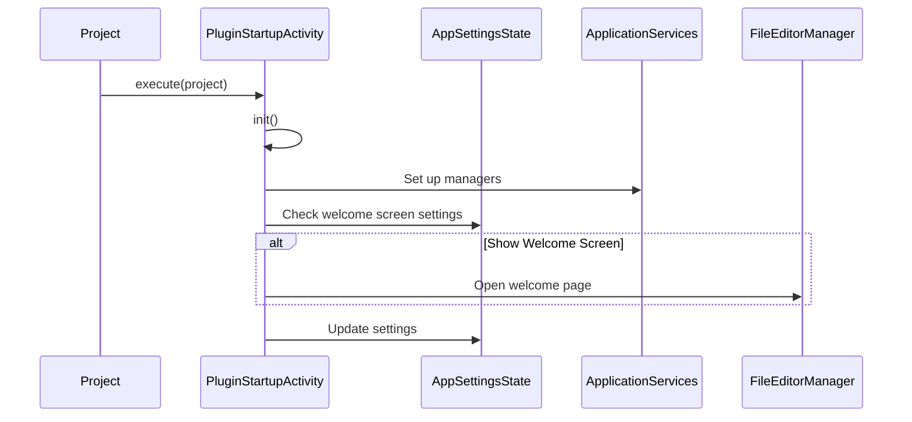

Here's a documentation overview for the provided Kotlin code:

## Code Overview
- **Language & Frameworks:** Kotlin, IntelliJ Platform SDK
- **Primary Purpose:** Plugin startup activity for an IntelliJ-based IDE
- **Brief Description:** This class handles the initialization of the plugin, including setting up application services, showing a welcome screen, and initializing various managers.

## Public Interface
- **Exported Functions/Classes:**
  - `PluginStartupActivity` class implementing `ProjectActivity`
- **Public Constants/Variables:**
  - `log`: Logger for the class

## Dependencies
- **External Libraries**
  - IntelliJ Platform SDK
  - SkyeNet Core
- **Internal Code: Symbol References**
  - `AppSettingsState`
  - `IdeaOpenAIClient`

## Architecture
- **Sequence Diagram:**

## Example Usage
This class is automatically instantiated and executed by the IntelliJ Platform when the plugin starts up.

## Code Analysis
- **Code Style Observations:**
  - Uses Kotlin idioms and language features
  - Extensive use of try-catch blocks for error handling
- **Code Review Feedback:**
  - Consider breaking down the `execute` method into smaller, more focused methods
  - Some hardcoded strings could be moved to constants
- **Features:**
  - Initializes application services and managers
  - Shows a welcome screen on first run or version update
  - Handles class loader context switching
- **Potential Improvements:**
  - Implement dependency injection for better testability
  - Add more detailed logging and error reporting
  - Consider making some of the initialization process asynchronous

## Tags
- **Keyword Tags:** IntelliJ, Plugin, Startup, Initialization
- **Key-Value Tags:**
  - Type: Startup Activity
  - Platform: IntelliJ
  - Language: Kotlin