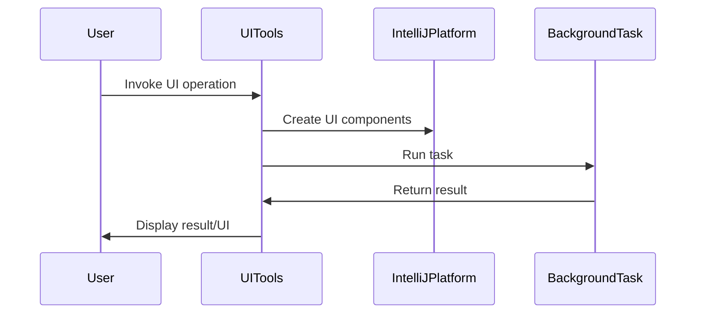

Here's a comprehensive documentation for the provided code:

## Code Overview
- **Language & Frameworks:** Kotlin, IntelliJ Platform SDK
- **Primary Purpose:** Provide utility functions for UI operations in an IntelliJ IDEA plugin
- **Brief Description:** This file contains a utility object `UITools` with various functions for creating and managing UI components, handling dialogs, running background tasks, and error handling in an IntelliJ IDEA plugin context.

## Public Interface
- **Exported Functions/Classes:**
  - `UITools` object with numerous utility functions
- **Public Constants/Variables:**
  - `retry`: WeakHashMap<Document, Runnable>
- **Types/Interfaces:**
  - `ModalTask<T>`: Custom task for modal operations
  - `BgTask<T>`: Custom task for background operations

## Dependencies
- **External Libraries**
  - Guava (com.google.common.util.concurrent)
  - IntelliJ Platform SDK
  - SLF4J
  - SwingX
- **Internal Code: Symbol References**
  - `AppSettingsState`
  - `IndentedText`
  - `OpenAIClient`
  - `APIProvider`

## Architecture
- **Sequence or Flow Diagrams:** 


- **Class Diagrams:** A class diagram would be useful to illustrate the relationship between UITools, ModalTask, BgTask, and their interaction with IntelliJ Platform components.

## Example Usage
```kotlin
// Show a dialog
val result = UITools.showDialog(project, MyUIClass::class.java, MyConfigClass::class.java, "My Dialog")

// Run a background task
UITools.run(project, "Background Task") { indicator ->
    // Task logic here
}

// Handle an error
UITools.error(logger, "An error occurred", exception)
```

## Code Analysis
- **Code Style Observations:**
  - Extensive use of Kotlin features (extension functions, lambdas)
  - Heavy use of IntelliJ Platform API
  - Comprehensive error handling and logging
- **Code Review Feedback:**
  - Well-structured and organized code
  - Good separation of concerns
  - Extensive use of generics for flexibility
- **Features:**
  - UI component creation and management
  - Dialog handling
  - Background task execution
  - Error handling and reporting
  - API key management
- **Potential Improvements:**
  - Consider breaking down the `UITools` object into smaller, more focused objects
  - Add more inline documentation for complex functions
  - Consider using coroutines for asynchronous operations instead of custom task classes

## Tags
- **Keyword Tags:** IntelliJ, UI, Dialog, Task, Error Handling, API Key
- **Key-Value Tags:**
  - Type: Utility
  - Platform: IntelliJ IDEA
  - Language: Kotlin