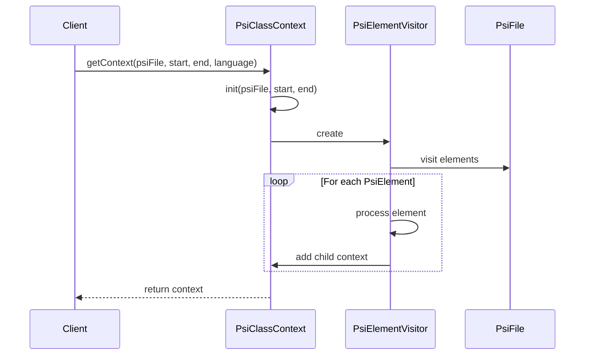

Here's a documentation overview for the provided Kotlin code:

## Code Overview
- **Language & Frameworks:** Kotlin, IntelliJ Platform SDK
- **Primary Purpose:** To create a context representation of a PSI (Program Structure Interface) class for code analysis and manipulation
- **Brief Description:** This code defines a `PsiClassContext` class that traverses a PSI tree, creating a structured representation of the code with focus on selected regions.

## Public Interface
- **Exported Classes:** `PsiClassContext`
- **Public Constants/Variables:** None
- **Types/Interfaces:** None explicitly defined

## Dependencies
- **External Libraries:** IntelliJ Platform SDK (com.intellij.psi.*)
- **Internal Code: Symbol References:**
  - `ComputerLanguage` (from com.github.simiacryptus.aicoder.util)
  - `PsiVisitorBase` (from com.github.simiacryptus.aicoder.util.psi)
  - `PsiUtil` (from com.github.simiacryptus.aicoder.util.psi)

## Architecture
- **Sequence Diagram:** 


## Example Usage
```kotlin
val psiFile: PsiFile = // ... obtain PsiFile
val selectionStart = 10
val selectionEnd = 50
val language = ComputerLanguage.Kotlin

val context = PsiClassContext.getContext(psiFile, selectionStart, selectionEnd, language)
println(context.toString())
```

## Code Analysis
- **Code Style Observations:** 
  - Uses Kotlin idioms and language features
  - Extensive use of lambda expressions and functional programming concepts
- **Code Review Feedback:**
  - Consider breaking down the large `visit` method into smaller, more focused methods
  - Add more inline comments to explain complex logic
- **Features:**
  - Handles different programming language constructs (methods, classes, fields, etc.)
  - Supports multiple programming languages (Java, Kotlin, Scala)
  - Provides a structured representation of code context
- **Potential Improvements:**
  - Implement error handling and logging
  - Add unit tests to ensure correct behavior for different scenarios
  - Consider using a builder pattern for more flexible context creation

## Tags
- **Keyword Tags:** PSI, IntelliJ, Code Analysis, Abstract Syntax Tree, Visitor Pattern
- **Key-Value Tags:**
  - complexity: high
  - maintainability: medium
  - extensibility: high