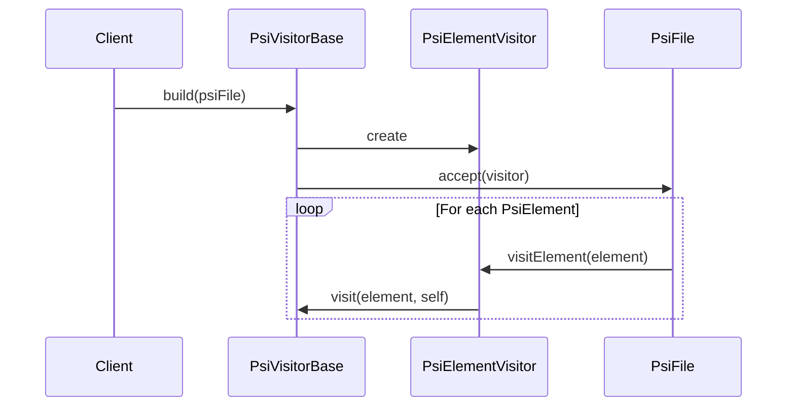

Here's a documentation overview for the provided Kotlin code:

## Code Overview
- **Language & Frameworks:** Kotlin, IntelliJ Platform SDK
- **Primary Purpose:** Provide a base class for PSI (Program Structure Interface) visitors in IntelliJ-based IDEs
- **Brief Description:** This code defines an abstract base class `PsiVisitorBase` that facilitates traversing the PSI tree of a file in IntelliJ-based IDEs.

## Public Interface
- **Exported Classes:** `PsiVisitorBase` (abstract)
- **Public Methods:** 
  - `build(psiFile: PsiFile)`: Initiates the PSI tree traversal

## Dependencies
- **External Libraries:** IntelliJ Platform SDK (com.intellij.psi package)
- **Internal Code: Symbol References:** None

## Architecture
- **Sequence Diagram:**


## Example Usage
```kotlin
class MyPsiVisitor : PsiVisitorBase() {
    override fun visit(element: PsiElement, self: PsiElementVisitor) {
        // Custom logic for visiting each PSI element
    }
}

// Usage
val visitor = MyPsiVisitor()
visitor.build(psiFile)
```

## Code Analysis
- **Code Style Observations:** 
  - Uses Kotlin's concise syntax
  - Utilizes atomic references for thread safety
- **Features:**
  - Provides a reusable base for PSI tree traversal
  - Allows custom logic implementation in derived classes
- **Potential Improvements:**
  - Consider adding error handling mechanisms
  - Could benefit from more detailed comments explaining the purpose of each method

## Tags
- **Keyword Tags:** PSI, visitor pattern, IntelliJ, Kotlin
- **Key-Value Tags:**
  - complexity: medium
  - usage: code analysis
  - platform: IntelliJ