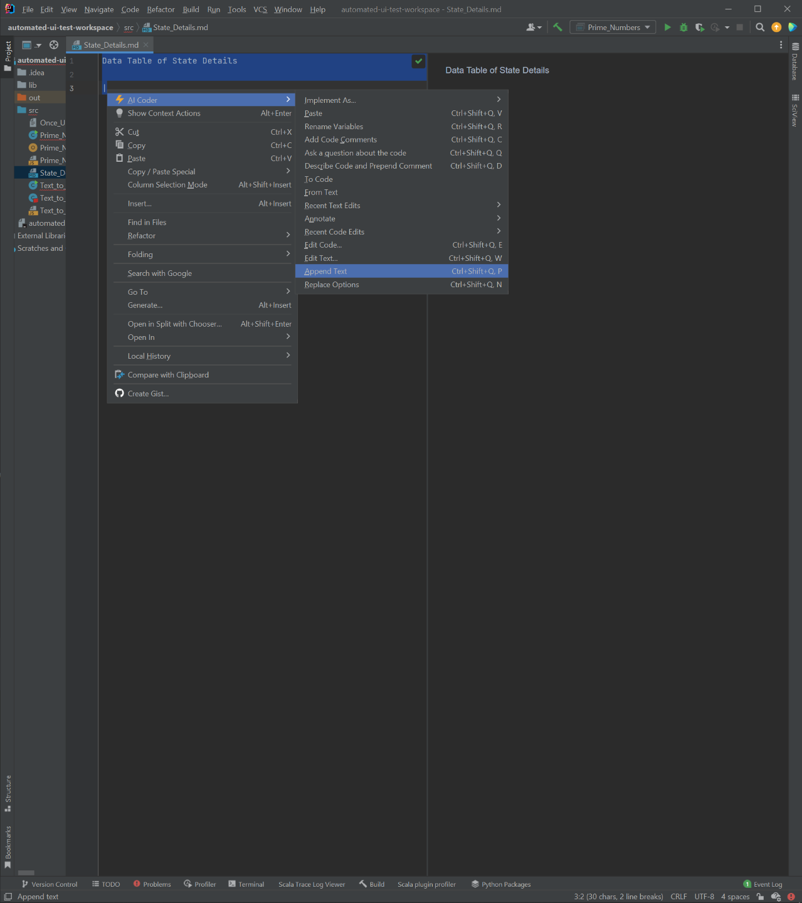
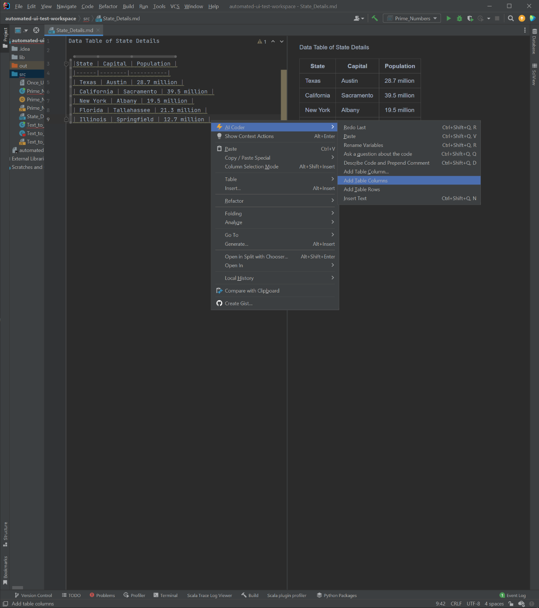
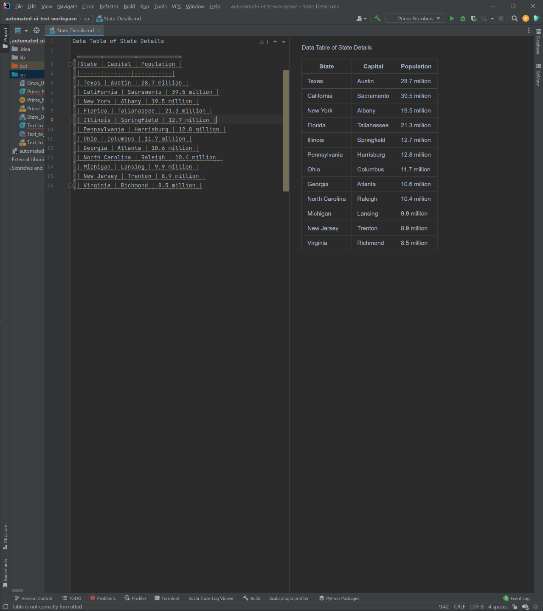
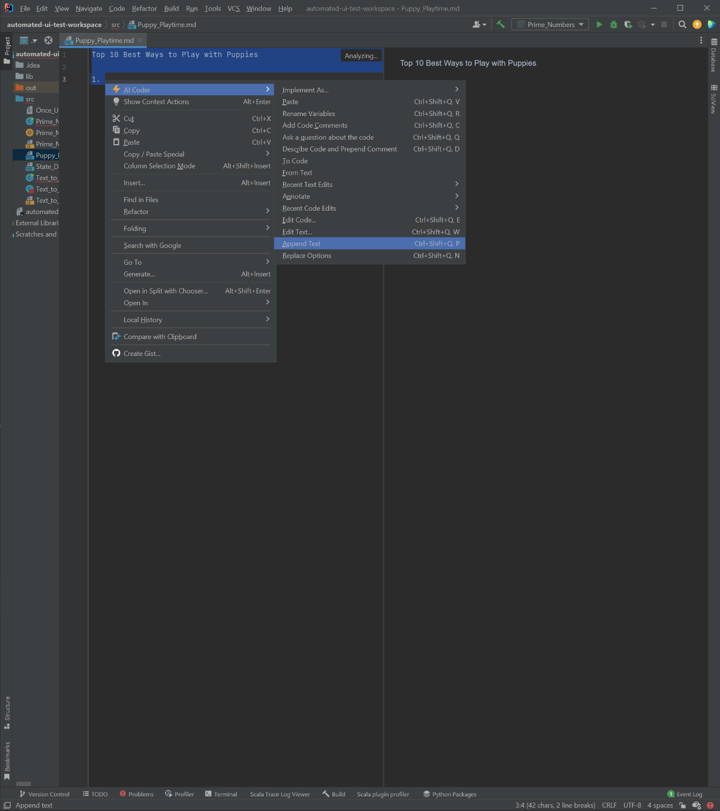
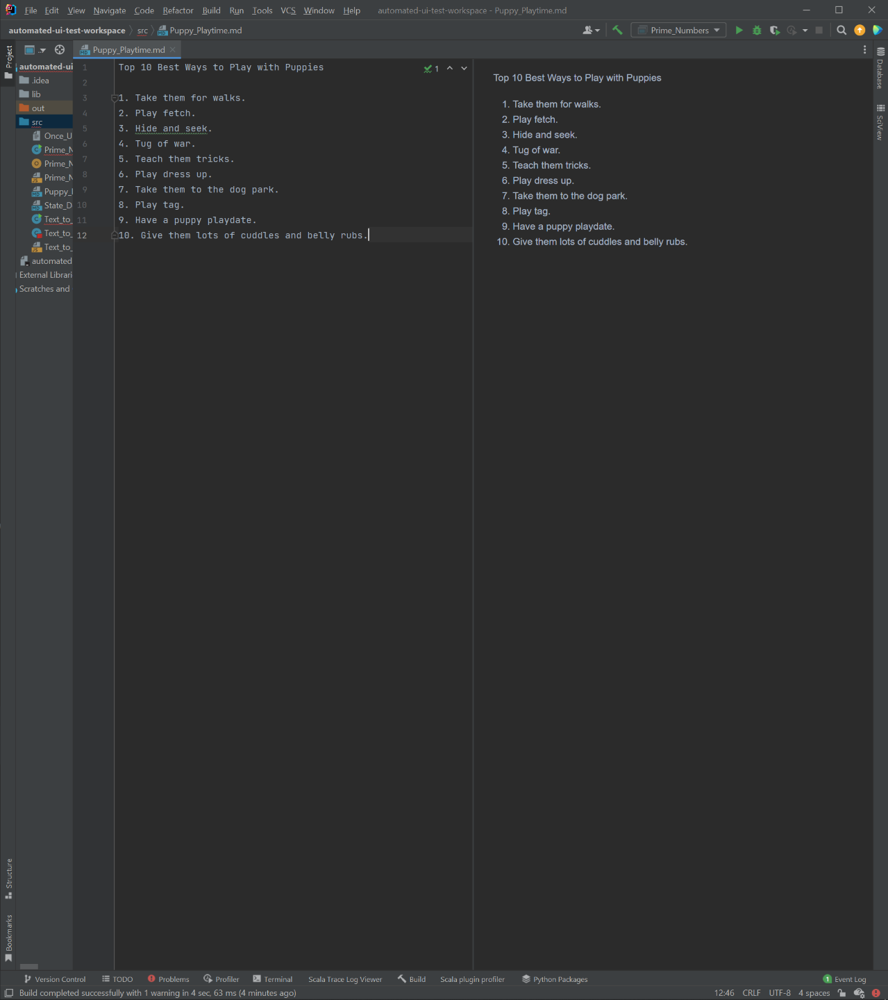
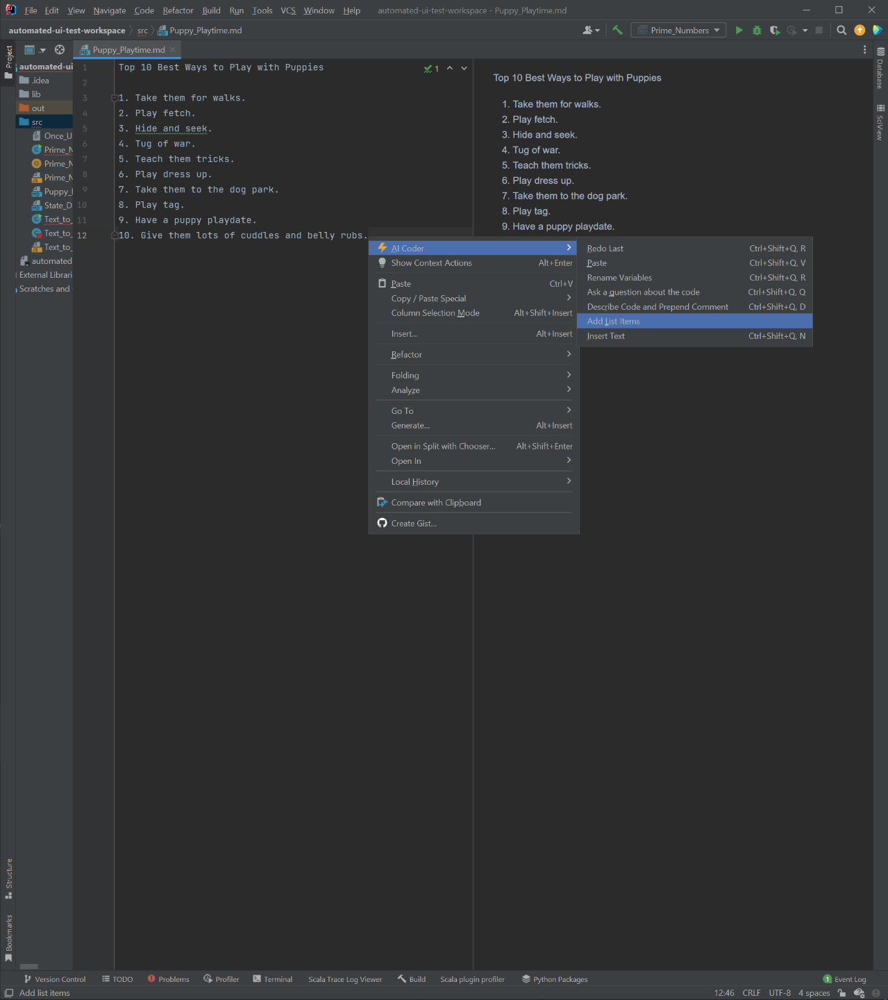
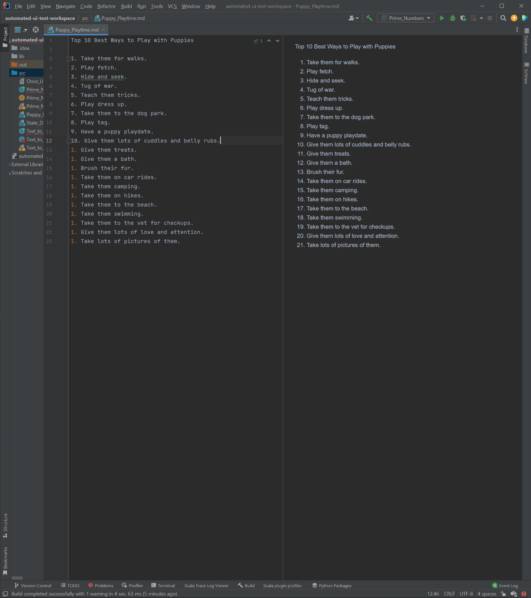

# State_Details

In this demo, we add a table to a Markdown document, and then add columns and rows to the table.

We start with this seed directive:

```
Data Table of State Details
```



This gives us the following Markdown document:

```
Data Table of State Details

|State | Capital | Population |
|------|--------|-----------|
| Texas | Austin | 28.7 million |
| California | Sacramento | 39.5 million |
| New York | Albany | 19.5 million |
| Florida | Tallahassee | 21.3 million |
| Illinois | Springfield | 12.7 million |
```




```
Data Table of State Details

| State | Capital | Population | Governor | Nickname | Area | Time Zone | Highest Point |
| --- | --- | --- | --- | --- | --- | --- | --- |
| Texas | Austin | 28.7 million | Greg Abbott | Lone Star State | 268,581 sq mi | Central | Guadalupe Peak |
| California | Sacramento | 39.5 million | Gavin Newsom | Golden State | 163,696 sq mi | Pacific | Mount Whitney |
| New York | Albany | 19.5 million | Andrew Cuomo | Empire State | 54,555 sq mi | Eastern | Mount Marcy |
| Florida | Tallahassee | 21.3 million | Ron DeSantis | Sunshine State | 65,758 sq mi | Eastern | Britton Hill |
| Illinois | Springfield | 12.7 million | J.B. Pritzker | Prairie State | 57,914 sq mi | Central | Charles Mound |

```


```
Data Table of State Details

|State | Capital | Population |
|------|--------|-----------|
| Texas | Austin | 28.7 million |
| California | Sacramento | 39.5 million |
| New York | Albany | 19.5 million |
| Florida | Tallahassee | 21.3 million |
| Illinois | Springfield | 12.7 million |
| Pennsylvania | Harrisburg | 12.8 million |
| Ohio | Columbus | 11.7 million |
| Georgia | Atlanta | 10.6 million |
| North Carolina | Raleigh | 10.4 million |
| Michigan | Lansing | 9.9 million |
| New Jersey | Trenton | 8.9 million |
| Virginia | Richmond | 8.5 million |
```



# Puppy_Playtime            

In this demo, we add a list to a Markdown document, and then add items to the list.

```
Top 10 Best Ways to Play with Puppies
```




```
Top 10 Best Ways to Play with Puppies

1. Take them for walks.
2. Play fetch.
3. Hide and seek.
4. Tug of war.
5. Teach them tricks.
6. Play dress up.
7. Take them to the dog park.
8. Play tag.
9. Have a puppy playdate.
10. Give them lots of cuddles and belly rubs.
```








```
Top 10 Best Ways to Play with Puppies

1. Take them for walks.
2. Play fetch.
3. Hide and seek.
4. Tug of war.
5. Teach them tricks.
6. Play dress up.
7. Take them to the dog park.
8. Play tag.
9. Have a puppy playdate.
10. Give them lots of cuddles and belly rubs.
1. Give them treats.
1. Give them a bath.
1. Brush their fur.
1. Take them on car rides.
1. Take them camping.
1. Take them on hikes.
1. Take them to the beach.
1. Take them swimming.
1. Take them to the vet for checkups.
1. Give them lots of love and attention.
1. Take lots of pictures of them.
```

