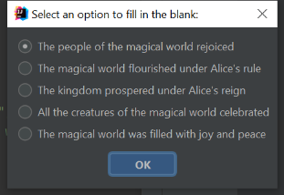
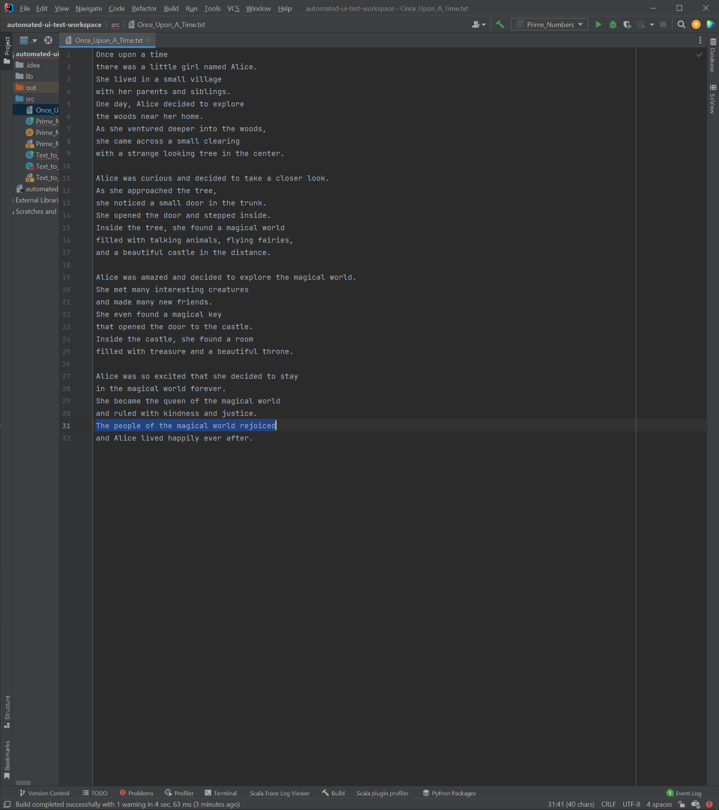

# Once_Upon_A_Time

In this example, we'll use the "Append Text" command to add some text after our prompt.

```
Once upon a time
```


This generates the following text:

```
Once upon a timethere was a little girl named Alice. She lived in a small village with her parents and siblings. One day, Alice decided to explore the woods near her home. As she ventured deeper into the woods, she came across a small clearing with a strange looking tree in the center.

Alice was curious and decided to take a closer look. As she approached the tree, she noticed a small door in the trunk. She opened the door and stepped inside. Inside the tree, she found a magical world filled with talking animals, flying fairies, and a beautiful castle in the distance.

Alice was amazed and decided to explore the magical world. She met many interesting creatures and made many new friends. She even found a magical key that opened the door to the castle. Inside the castle, she found a room filled with treasure and a beautiful throne.

Alice was so excited that she decided to stay in the magical world forever. She became the queen of the magical world and ruled with kindness and justice. Everyone in the magical world was happy and Alice lived happily ever after.
```


## Edit Text

We can also edit the text using the "Edit Text" command.


We can also replace text using the "Replace Options" command.







Our text now looks like this:

```
Once upon a time
there was a little girl named Alice.
She lived in a small village
with her parents and siblings.
One day, Alice decided to explore
the woods near her home.
As she ventured deeper into the woods,
she came across a small clearing
with a strange looking tree in the center.

Alice was curious and decided to take a closer look.
As she approached the tree,
she noticed a small door in the trunk.
She opened the door and stepped inside.
Inside the tree, she found a magical world
filled with talking animals, flying fairies,
and a beautiful castle in the distance.

Alice was amazed and decided to explore the magical world.
She met many interesting creatures
and made many new friends.
She even found a magical key
that opened the door to the castle.
Inside the castle, she found a room
filled with treasure and a beautiful throne.

Alice was so excited that she decided to stay
in the magical world forever.
She became the queen of the magical world
and ruled with kindness and justice.
The people of the magical world rejoiced
and Alice lived happily ever after.
```

