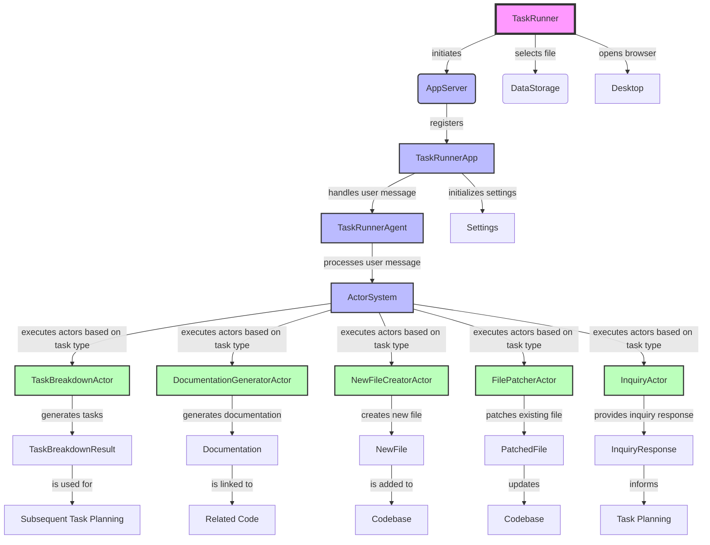

The provided Kotlin code outlines a complex application designed for task planning and execution, integrating with a chat server and utilizing AI models for task breakdown, documentation generation, new file creation, file patching, and inquiries. The application leverages several components, including an IntelliJ plugin, a web UI, and AI-driven actors for processing user inputs and generating code or documentation. Below is a mermaid.js diagram that visualizes the high-level architecture and flow of this application.

### Key Components and Flow:

- **TaskRunner**: Initiates the task planning process, interacts with the `AppServer` for web UI, selects files via `DataStorage`, and opens a browser window for user interaction.
- **AppServer & TaskRunnerApp**: Hosts the application server and registers the `TaskRunnerApp` which manages sessions and settings.
- **TaskRunnerAgent**: Acts as the central processor for user messages, utilizing an `ActorSystem` to delegate tasks to specific actors based on the task type.
- **ActorSystem & Actors (TaskBreakdown, DocumentationGenerator, etc.)**: Processes user messages to perform specific actions like task breakdown, documentation generation, file creation, patching, and inquiries.
- **Results (TaskBreakdownResult, Documentation, etc.)**: Outputs generated by the actors, which are used for further task planning, code documentation, file creation, or patching.

This diagram and description provide a simplified overview of the application's architecture and logic flow. The actual implementation may involve more detailed interactions and components not fully captured here.